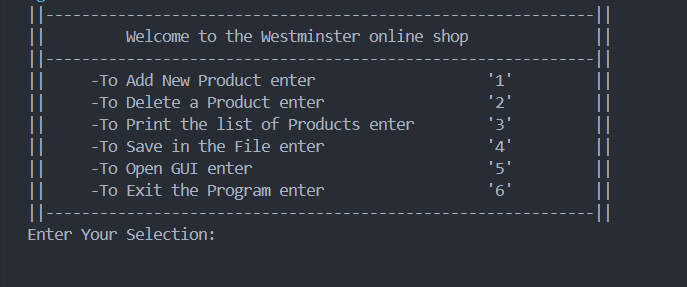

# Shopping-Management-System

This repository contains a Shopping Management System using Java and Java Swing.

<br>


<br>


## Getting Started

The essential procedures required for initiating and configuring the project within your local environment.

### Prerequisites

1. Need to have JDK(Java Development Kit) 21 and IntelliJ IDEA .

### Installation

1. Clone the repository and retrieve it onto your local machine.

   ```sh
   git clone https://github.com/Tharanesh-github/Shopping_Management.git
   ```

2. Navigate to the Cloned Repository

   ```sh
   cd Shopping_Management
   ```

3. Run the application.

## License

This repository is distributed under the MIT License. See LICENSE.md for additional information.
